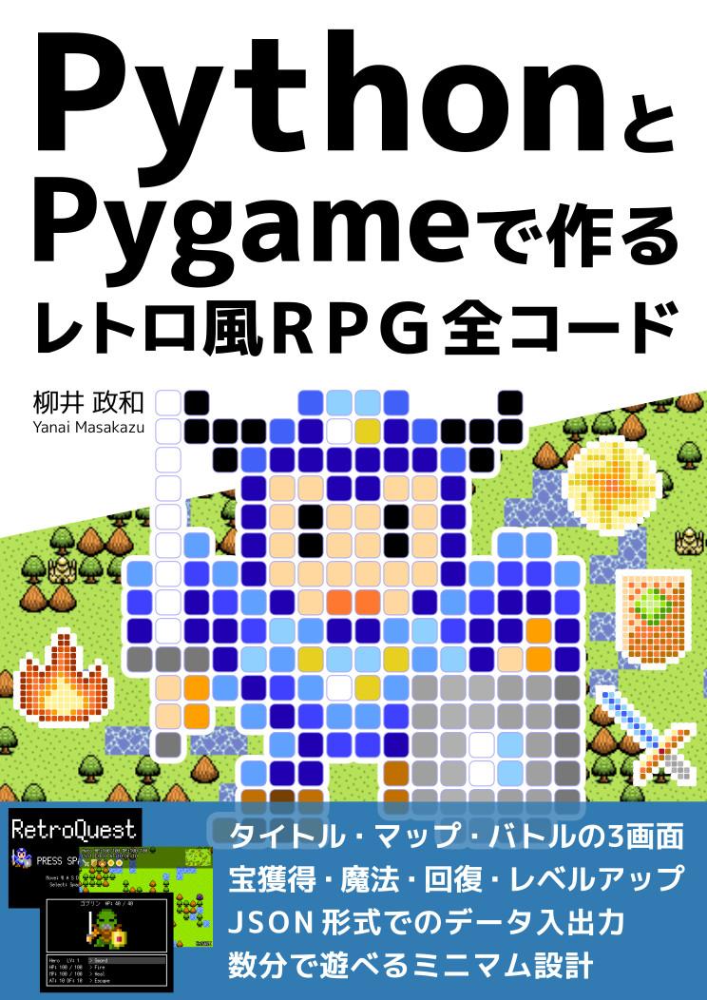

# PythonとPygameで作るレトロ風RPG全コード

『PythonとPygameで作るレトロ風RPG全コード』のサンプルコードなどをまとめておきます。

* サンプルコード
    * [ZIPファイル](./data/sample_code.zip)
* 頒布ページ
    * [PythonとPygameで作るレトロ風RPG全コード](https://crocro.com/shop/item/python_pygame_rpg.html)
* 試し読みページ
    * [PythonとPygameで作る レトロ風RPG 全コード](https://crocro.com/write/python_pygame_rpg/)

表紙画像やゲームのスクリーンショットは、紹介などでご自由に利用ください。

## 表紙画像

## 作成するゲームのスクリーンショット

## 簡略化した目次

* 第1章  開発するゲーム
* 第2章  開発環境の構築
* 第3章  Pythonの基本的な文法
* 第4章  Pygameの使い方
* 第5章  main.pyと初期化
* 第6章  データ パッケージ
* 第7章  イメージ パッケージ
* 第8章  ゲーム パッケージ
* 第9章  タイトル シーン パッケージ
* 第10章  マップ シーン パッケージ
* 第11章  バトル シーン パッケージ
* 第12章  その他のプログラム

## 詳細な目次

* まえがき
    * 目次
* 第1章  開発するゲーム
    * 1-1　どんなゲームを作るか
    * 1-2　使用する素材
    * 1-3　この本の進行について
    * 1-4　開発するゲームのファイル構成
* 第2章  開発環境の構築
    * 2-1　Pythonの導入
    * 2-2　Visual Studio Codeでの準備
    * 2-3　venvの利用
    * 2-4　Pygameの導入
    * 2-5　PyInstallerの導入
    * 2-6　mypyの導入
* 第3章  Pythonの基本的な文法
    * 3-1　Pythonの特徴
    * 3-2　変数や単純な型
    * 3-3　複数の値を格納する型
    * 3-4　関数
    * 3-5　条件分岐
    * 3-6　繰り返し処理
    * 3-7　例外処理
    * 3-8　モジュール
    * 3-9　クラス
    * 3-10　async/await
* 第4章  Pygameの使い方
    * 4-1　Pygameの基本的な処理
    * 4-2　画像描画
    * 4-3　図形描画
    * 4-4　文字描画
    * 4-5　スプライト
    * 4-6　キー入力
    * 4-7　マウス入力
    * 4-8　音声
* 第5章  main.pyと初期化
    * 5-1　プログラムの開始場所
    * 5-2　初期化
    * 5-3　実行のバッチファイル
* 第6章  データ パッケージ
    * 6-1　データの構成
    * 6-2　保存するデータ1　ゲーム
    * 6-3　保存するデータ2　アイテム
    * 6-4　保存するデータ3　マップ
    * 6-5　保存するデータ4　マップ イベント
    * 6-6　補助的な関数群1　成長
    * 6-7　補助的な関数群2　入出力
    * 6-8　保存しないデータ1　アクション
    * 6-9　保存しないデータ2　アプリケーション
    * 6-10　保存しないデータ3　音声
    * 6-11　保存しないデータ4　バトル
    * 6-12　保存しないデータ5　敵
    * 6-13　保存しないデータ6　シーン
* 第7章  イメージ パッケージ
    * 7-1　描画の構成
    * 7-2　スクリーン
    * 7-3　ユーティリティ
    * 7-4　スプライト1　キャラクター
    * 7-5　スプライト2　マップ
    * 7-6　フォント
    * 7-7　ダイアログ
* 第8章  ゲーム パッケージ
    * 8-1　ゲーム用モジュール
    * 8-2　BGMとSE
    * 8-3　キーなどのイベント
    * 8-4　シーンとシーン管理
* 第9章  タイトル シーン パッケージ
    * 9-1　タイトル シーン用パッケージ
    * 9-2　メイン
    * 9-3　描画1　キャラクター
    * 9-4　描画2　テキスト
* 第10章  マップ シーン パッケージ
    * 10-1　マップ シーン用パッケージ
    * 10-2　メイン
    * 10-3　移動
    * 10-4　イベント管理
    * 10-5　描画1　キャラクター
    * 10-6　描画2　アイテム
    * 10-7　描画3　ミニマップ
    * 10-8　描画4　テキスト
    * 10-9　描画5　その他の表示
* 第11章  バトル シーン パッケージ
    * 11-1　バトル シーン用パッケージ
    * 11-2　メイン
    * 11-3　進行1　メニュー
    * 11-4　進行2　自分の行動
    * 11-5　進行3　敵の行動
    * 11-6　進行4　成長
    * 11-7　描画1　キャラクター
    * 11-8　描画2　その他の表示
    * 11-9　戦闘1　自分の行動
    * 11-10　戦闘2　敵の行動
    * 11-11　戦闘3　ユーティリティ
    * 11-12　エフェクト1　管理
    * 11-13　エフェクト2　行動用
    * 11-14　エフェクト3　その他
* 第12章  その他のプログラム
    * 12-1　サンプル付属のその他のプログラム
    * 12-2　ゲームの実行とEXE化
    * 12-3　mypyの実行
    * 12-4　プログラムの例を選んで実行
    * 12-5　画像ファイルを作って出力
* あとがき
